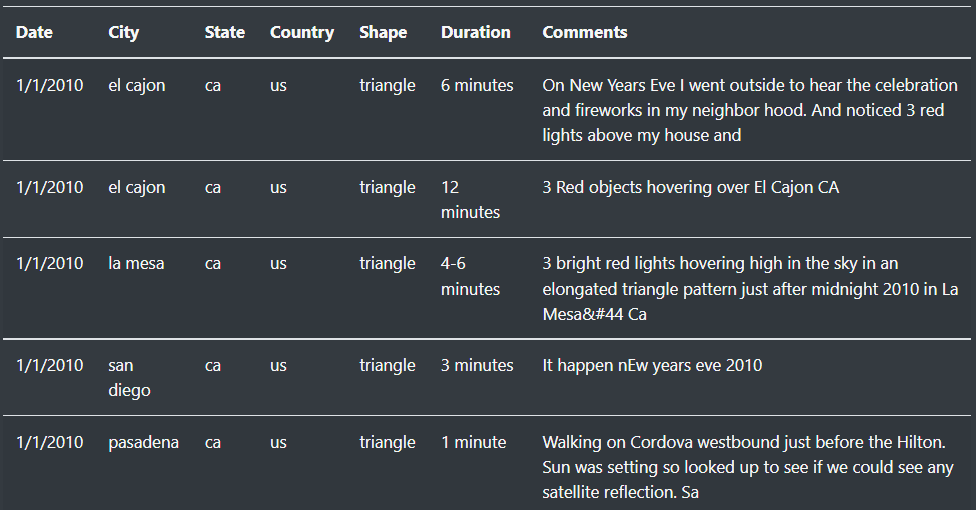

# UFOs
JavaScript, HTML, CSS, Bootstrap

## Overview of Project
### Purpose

The purpose of this project is to build a **dynamic webpage** that displays UFOs sightings information for upcoming annual gathering of UFO enthusiasts in McMinnville, Oregon. There is a lot of data to display so adding filters to the table which let users to refine their search on more than one level is necessary.  

## Requirements:
The webpage contains the following:
-   Interactive filters for searching criteria on date, city, country, and shape.
-   Brief article and its summary.
-   An attention-grabbing header with a refresh-page link.
-   Visually appealing design of overall presentation of the data.

<i>Image from the header of the webpage.<i>

### Background 
For this project we are using **JavaScript** as the primary coding language. JavaScript (JS) is a scripting language, primarily used on the Web. It is used to enhance HTML pages and is commonly found embedded in HTML code. JavaScript is an interpreted language. Thus, it doesn't need to be compiled. JavaScript renders web pages in an interactive and dynamic fashion.

## Resources

- **Data Source:** JavaScript list [data.js](static/js/data.js)
- **Software:** VS Code and Chrome Developer Tools, 
- **Languages:** JavaScript, HTML, CSS and Bootstrap 3
  - The table is built by inserting **JavaScript** into HTML page. [app.py]( static/js/app.js).
  - **HTML** to build the webpage [index.html](index.html).
  - **CSS** and **Bootstrap** to build and style the page [style.css](static/css/style.css)
  - **Chrome Developer Tools** to test the code.
- **Dependencies: ** D3(Data Driven Document)- We can Build a real-world, custom, interactive and beautiful data visualization from scratch using D3.

## Results

The Raw data from JavaScript array is going displayed in a dynamic table where end-users can filter the data on multiple criteria such as **date**, **city**, **state**, **country** and **shape** of UFOs sightings. 
Here filter input box is suggesting end-user that, how search criteria should be entered with using text value in it. For example, date should be entered in format as in 1/10/2010 – with forward slashes and without extra 0 before day and month. City, state, and country should be entered in lower case.

Dynamic multi-filter.

When user types of criteria in multi-filter and then press enter then table displays only rows that matches the user input. From the picture below we can see only data that has been filtered based on the user input – that is -- *State: ca, Shape: triangle and Date: 1/1/2010*.

<i>New table, displays only the results that matches the user’s input. </i>

To resetting the filter, there are two options. User can either clear input manually by deleting input cell by cell or click the refresh button *UFO Sightings* that can be found at the top left corner of the page. After the filter is cleared, the user can use filter again.

<i>Reset filter and refresh page button at the top left corner of the webpage. </i>

## Summary

This webpage does give a great overview of UFO sightings in the US, but it does have a few shortcomings. 

### Drawbacks

- It does not have the functionality to add live data. 

- The data that is a part of the "data file" will stay the same unless and until someone change it.

- Instead of "UFO Sightings" reset link, we can add some functions which will reset page automatically. Also provide some "TOP" and "BOTTOM" functions to scroll page up and down to make it user friendly.

### Recommendations for further analysis

- **Converting all input to lower case. ** Adding line of code that would convert all letters to lower case from user input. For example, no matter which format user used to type “CA” or “Ca” instead of “ca”, the code will still be able to process and find the results.

- **Adding drop down-menu from the filter. ** Also Sometimes users don’t know what exactly they are looking for in just exploring the web-page and its data. So We can increase the positive approach of user by adding drop-down menu, for the ease instead of guessing the options.

